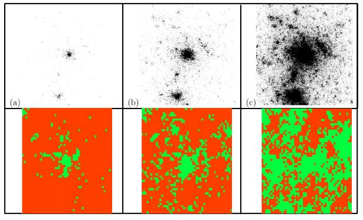

## GeoSim-Final-Project
Repository for the final project in Geosimulation Modelling (WS 2017/2018).

#### Team members:
Monica, Pramit, Raphael, Zhendong

#### Paper:
We are working with the paper "Distance-weighted city growth" by Rybski et al. (2013).

#### Task:
The task was to create a model that reproduces the outcomes of the paper.
Here you can see our results:

